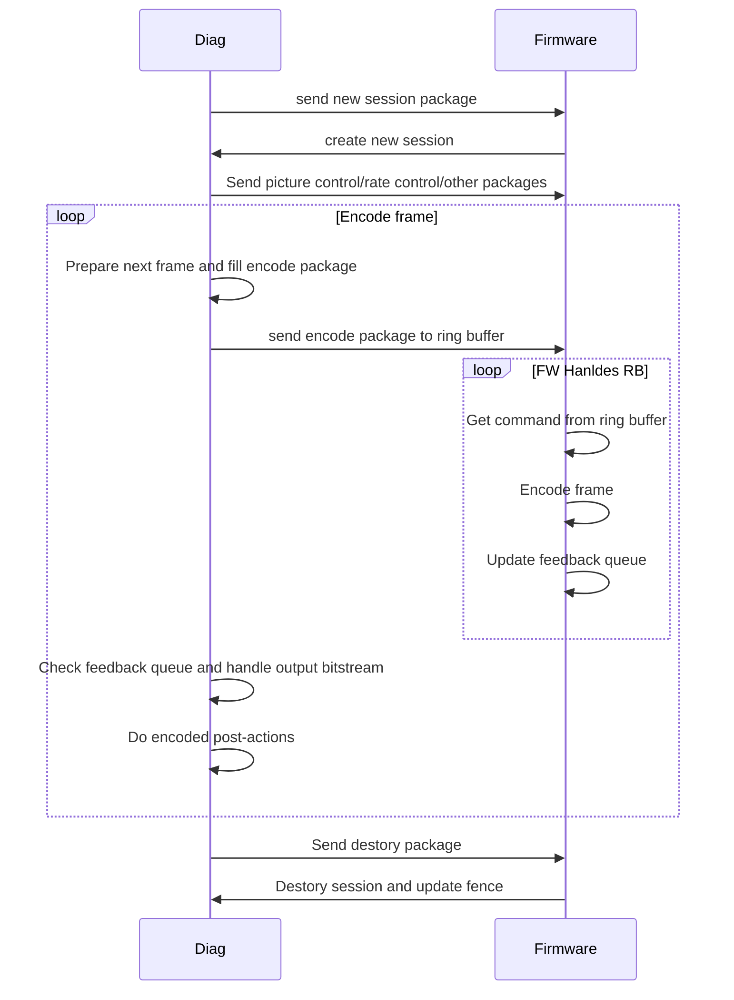
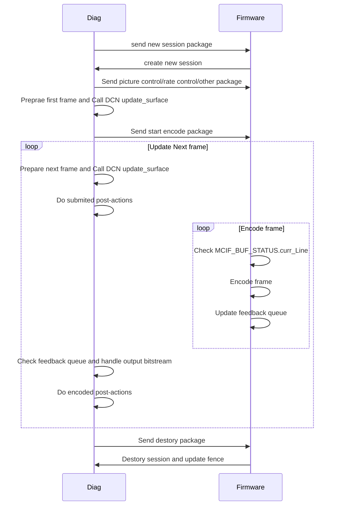

Encoding from memory

```mermaid
sequenceDiagram
    participant Diag
    participant Firmware
    Diag->>Firmware: send new session package
    Firmware->>Diag: create new session
    Diag->>Firmware: Send picture control/rate control/other packages
    loop Encode frame
        Diag ->> Diag: Prepare next frame and fill encode package
        Diag->>Firmware: send encode package to ring buffer
        loop FW Hanldes RB
            Firmware->>Firmware: Get command from ring buffer
            Firmware->>Firmware: Encode frame
            Firmware->>Firmware: Update feedback queue
        end
        Diag->>Diag: Check feedback queue and handle output bitstream
        Diag ->> Diag: Do encoded post-actions
    end

    Diag->>Firmware: Send destory package
    Firmware->>Diag: Destory session and update fence
```
DWB

```mermaid
sequenceDiagram
    participant Diag
    participant Firmware
    Diag->>Firmware: send new session package
    Firmware->>Diag: create new session
    Diag->>Firmware: Send picture control/rate control/other package
    Diag->>Diag: Preprae first frame and Call DCN update_surface
    Diag->>Firmware: Send start encode package
    loop Update Next frame
        Diag->>Diag: Prepare next frame and Call DCN update_surface
        Diag->>Diag: Do submited post-actions
        loop Encode frame
            Firmware->>Firmware: Check MCIF_BUF_STATUS.curr_Line
            Firmware->>Firmware: Encode frame
            Firmware->>Firmware: Update feedback queue
        end
        Diag->>Diag: Check feedback queue and handle output bitstream
        Diag->>Diag: Do encoded post-actions
    end
    Diag->>Firmware: Send destory package
    Firmware->>Diag: Destory session and update fence
```