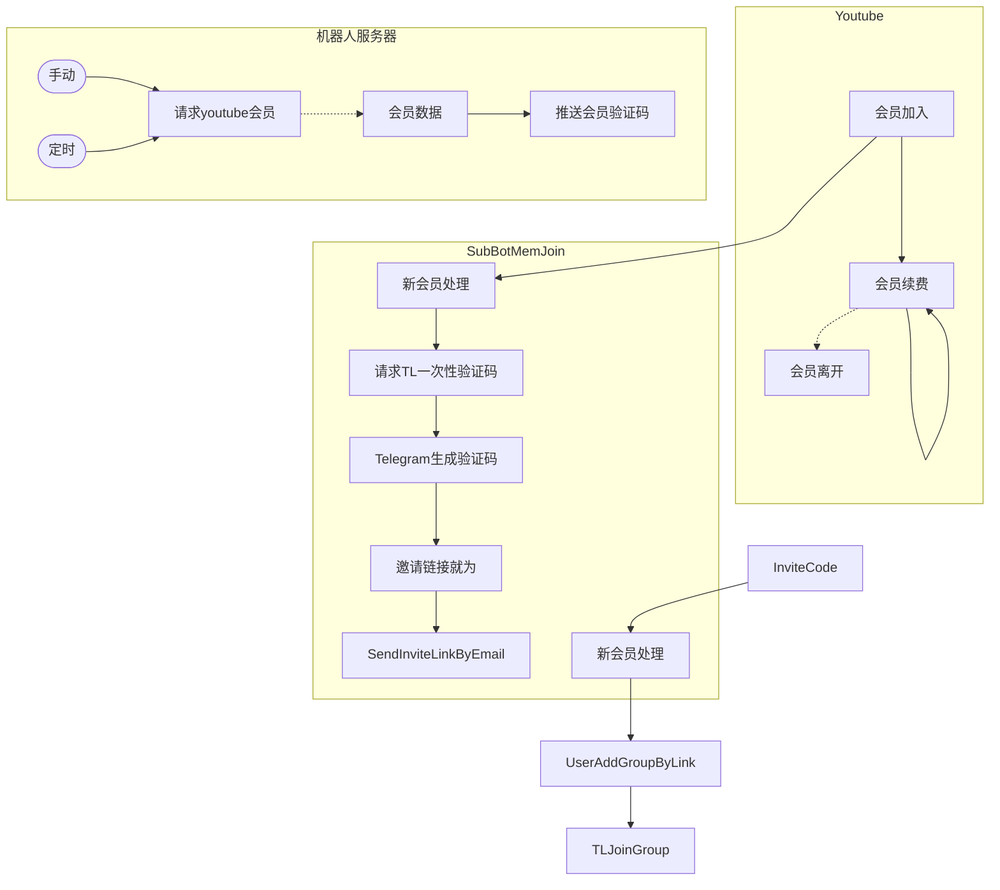

## 新用户加入

```mermaid
graph TB


    subgraph YBServer[Youtube]
        MemJoin[会员加入]
        MemRenew[会员续费]
        MemLeave[会员离开]
        
        MemJoin --> MemRenew
        MemRenew --> MemRenew
        MemRenew -.-> MemLeave
    end

    subgraph SubBotServer[机器人服务器]
        TriggerManual([手动])
        TriggerClock([定时])
        YbMemReq[请求youtube会员]
        YbMemHandler[会员数据]
        YbMailCode[推送会员验证码]

        

        TriggerManual --> YbMemReq
        TriggerClock --> YbMemReq
        YbMemReq -.-> YbMemHandler
        YbMemHandler --> YbMailCode
    end

    subgraph SubBotMemJoin
        BotMemJoinReq[新会员处理]
        BotMemJoinReqInviteLink[请求TL一次性验证码]
        BotMemJoinInviteLinkReady[邀请链接就为]
        BotMemJoinReq --> BotMemJoinReqInviteLink

        BotMemJoinInviteLinkReady --> SendInviteLinkByEmail


        TlGenInviteLink --> BotMemJoinInviteLinkReady
        

        BotMemJoinSendInviteLink[新会员处理]
    end


    TlGenInviteLink[Telegram生成验证码]


    MemJoin --> BotMemJoinReq
    InviteCode --> BotMemJoinSendInviteLink
    BotMemJoinReqInviteLink --> TlGenInviteLink
    BotMemJoinSendInviteLink --> UserAddGroupByLink
    UserAddGroupByLink --> TLJoinGroup
```
## 用户续费

## 用户离开

