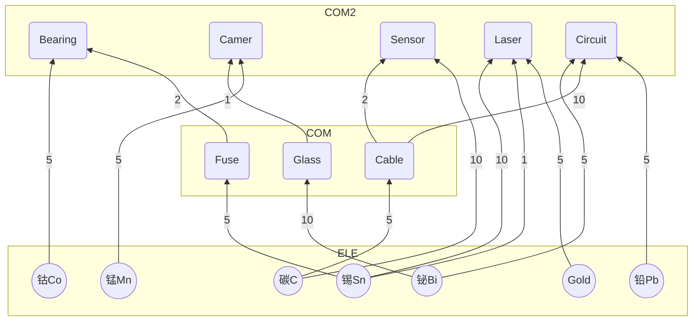

Just for fun

```mermaid
graph BT

    subgraph ELE
        ELE_C((碳C))
        ELE_Mn((锰Mn))
        ELE_Co((钴Co))
        ELE_Pb((铅Pb))
        ELE_Sn((锡Sn))
        ELE_Bi((铋Bi))
        ELE_Gold((Gold))
    end

    subgraph COM
        COM_Cable(Cable)
        COM_Fuse(Fuse)
        COM_Glass(Glass)
    end

    subgraph COM2
        COM2_Bearing(Bearing)
        COM2_Camer(Camer)
        COM2_Sensor(Sensor)
        COM2_Laser(Laser)
        COM2_Circuit(Circuit)
    end


    ELE_C -- 5 --> COM_Cable

    ELE_Sn -- 5 --> COM_Fuse

    

    ELE_Co -- 5 --> COM2_Bearing

    COM_Fuse -- 2 --> COM2_Bearing

    ELE_Bi  -- 10 --> COM_Glass

    ELE_Bi  -- 5 --> COM2_Circuit
    COM_Cable  -- 10 --> COM2_Circuit
    ELE_Pb  -- 5 --> COM2_Circuit

    COM_Cable -- 2 --> COM2_Sensor
    ELE_C -- 10 --> COM2_Sensor

    COM_Glass(Glass) -- 1 --> COM2_Camer
    ELE_Mn -- 5 --> COM2_Camer

    ELE_Sn -- 10 --> COM2_Laser
    ELE_Sn -- 1 --> COM2_Laser
    ELE_Gold -- 5 --> COM2_Laser


``` 