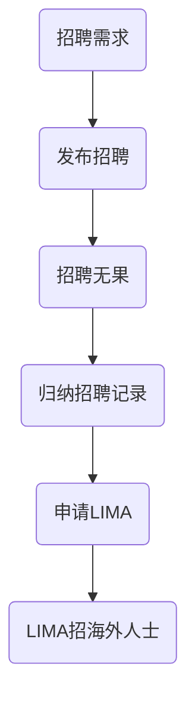
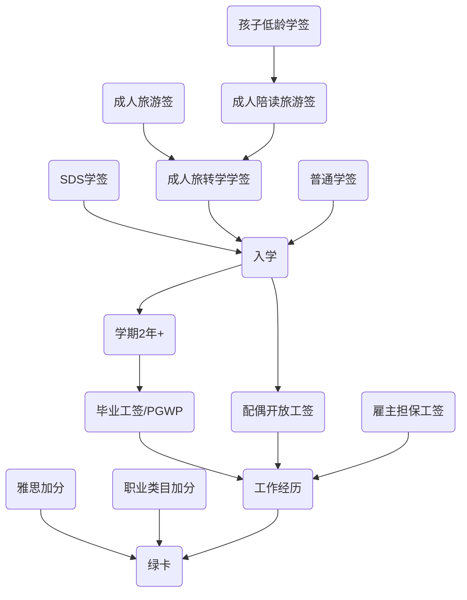

<!-- toc -->

# 修改日志
-  2022/11/5 
    - 选项篇初稿
- 2022/11112
    - 补充了穷人工人的一些条件
# 归纳黄页
[移民归纳--鸽总日记](/2022/10/28/imm-geziwang-roadmap/)

# 绿卡的必经之路
- 工作
- 学习->工作
- 企业家

## 高端玩法
### 学霸的专用通道
任选一条：
- 加拿大的研究生以上毕业（省份要求不太一样）
- 雅思8777+国内工作经验+年轻
- 更多的大佬title

### 码农学霸的专用通道
- leetcode上船亚马逊谷歌

### 真土豪不怕死的通道
- 雇主担保
    - 70万左右
    - 完全看移民顾问的良心，[顾问的黑名单](https://www.youtube.com/watch?v=eh-BMQdvFNQ&t=5s)
- BC省真实程序员通道--来源于考拉爸，[仅供参考](https://www.youtube.com/watch?v=ZrZZf4OMCTk&t=6s)

雇主担保其实属于下边的工作经历累计的玩法，人家只是不怕浪费钱。

## 加拿大工作经历
只要你有了加拿大的工作经历，你就可以申请绿卡了，加麻大采用打分制，核心三点，第一点占比70以上%：
- 加拿大一年以上的工作经历（合法）
- 其他
    - 雅思水平
    - 工作类型

### 工作签证是核心
所以可以看出来合法的工作经历是问题的主轴，一个合法的工作签证就是我们最大的目标。

# 工签之路
## 几乎不可能的直接签证
任何人都可以在网上跨国投简历或者让朋友内推，存在那么一点点的希望拿到直接工签。  

**只有非常少量的人可以直接拿到工签**，因为加拿大的雇主如果想雇佣海外工人，需要获取LIMA（劳工批文），只有具有LIMA的公司才可以合法招聘海外员工。   
申请LIMA对于一个公司来说成本非常巨大，需要很多资料时时间，所以请扪心自问，我配吗？

## 曲线救国的工签之路

这个是简化版本的，详细的版本见[签证路径篇](/2022/10/31/imm-visa-review/)

# 穷人的工作签证
加拿大每年都需要很多基础工作，如果你满足这些公众，你可能会比较容易拿到直接签证，所以学英语吧   
如果你想尝试一下如下的项目，请确保自己满足对应的条款   
这些类型的工作都是加拿大的紧缺工作，对应LIMA劳工批文的审批会很容易。

## 农民
农场季节工，短期签证，经常用来补充收获季节的劳工短缺。  
   
   
核心就是入境后，你可以前往各个省份省份，尝试继续其他长期工作，并且入境记录有利于你其他签证。

感谢网友[YvrFrank](https://twitter.com/YvrFrank)提供的相关视频[My Farmland
](https://www.cbc.ca/cbcdocspov/episodes/my-farmland)   

条件：
- 对应国内的工作经验，相关正规公司的工作，工资，银行流水
- 各类农具机械驾驶
- 各种农业机械的简单维修
- 雅思4分以上

## 伐木工人/理发师
条件：
- 对应国内的工作经验，相关正规公司的工作，工资，银行流水
- 雅思4分以上

## 厨师
条件：
- 对应国内的工作经验，相关正规公司的工作，工资，银行流水
- 国家厨师证明
- 至少一种菜系的证明
- 雅思4分以上

## 保姆
条件：
- 对应国内的工作经验1年+，相关正规公司的工作，工资，银行流水
- 雅思4分以上

