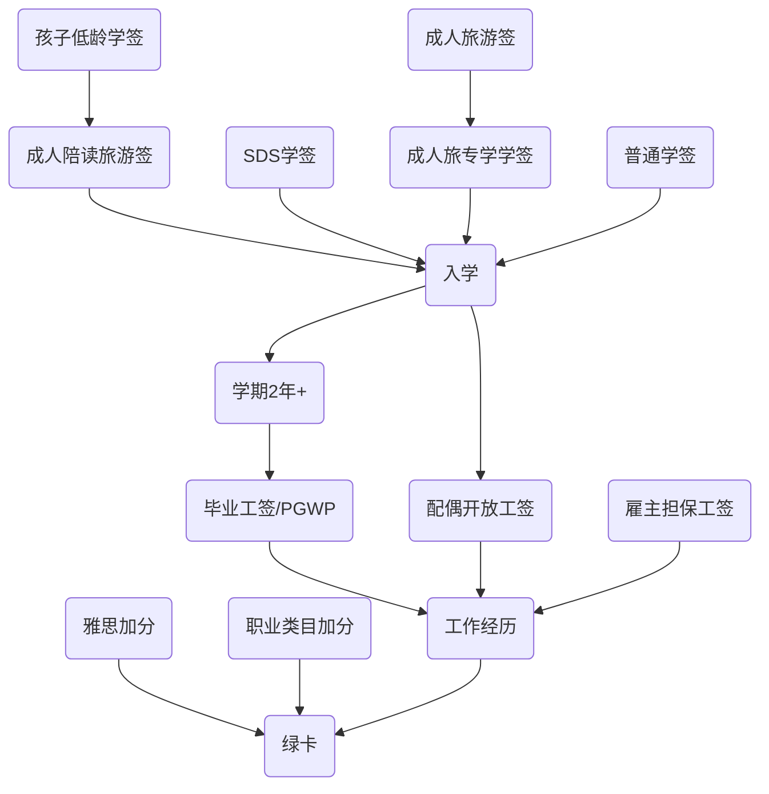

<!-- toc -->

# 修改日志
* 2022/11/5 选项篇
# 归纳黄页
[移民归纳--鸽总日记](/2022/10/28/imm-geziwang-roadmap/)

# 绿卡的必经之路
## 学霸的专用通道
任选一条：
- 加拿大的研究生以上毕业（省份要求不太一样）
- 雅思8777+国内工作经验+年轻
- 更多的大佬title

## 普通的通道
普通人的通道，就要走打分制了，所以以下都是越多越好
- 加拿大一年以上的工作经历（合法）
- 雅思水平

## 核心的核心
所以可以看出来合法的工作经历是问题的主轴，一个合法的工作签证就是我们最大的目标。

## 常见的绿卡之路

这个是简化版本的，详细的版本见[签证路径篇](/2022/10/31/imm-visa-review/)

