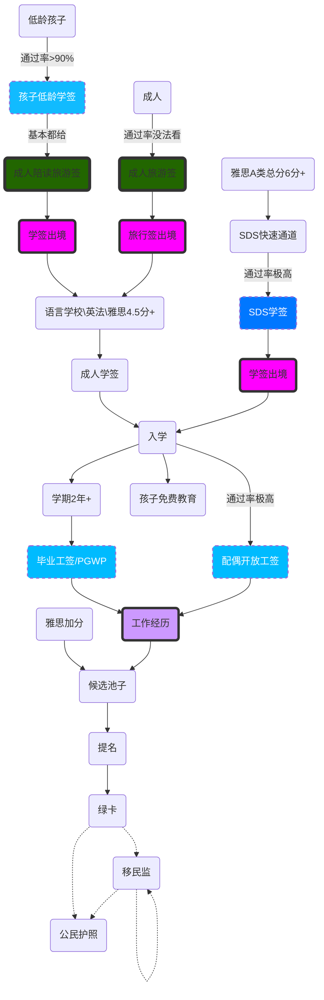

<!-- toc -->

# 修改日志
* 2022/10/29 初稿, 汇总一下当天别人的问题

# 归纳黄页
[移民归纳--鸽总日记](/2022/10/28/imm-geziwang-roadmap/)

# 签证审核

## 审核考量

### 资金
连准备花的钱都没有，你出来干嘛呢？想吃我国的福利嘛？gun！！！  
要点：
- 多多益善
- 细水长流，我工资不低，长远值得期待

### 移民倾向
移民倾向一个大家都心知肚明，但是都要装作没有的东西，你准备各种资料装作不想移民，移民官负责找你的漏洞
- 父母双亡穷逼大龄单身狗， 一看来了不想走
- 没车没房，原因如上
- 国内没啥值得留恋的东西和关系，那你明显是想赖上我了

### 移民政策
移民局的政策是随着国际国内形势不断调整的：

- 我国留学生少，没有他们的学费，我们教育部门怎么做下一年的预算，用爱发电嘛
- 国内劳工高中低端都确认，赶紧放水，是活的就行（比如疫情期间）
- 俄罗斯是坏蛋，移民官： 看到大毛我就生气，看到孝子也生气
- 乌克兰被欺负，二毛不哭，爸爸爱你
- 中国，印度 这些人基本来了都不想走，好好审一下，择优录取

## 加拿大的签证审核路径

不同的签证走不同的签证审核流程和不同的国家的部门

**通过指数只是当前情况下的相对参数，不代表通过率**

| 类型 | 计算机预审 | 人工审核部门 | 通过指数/10分 | 备注 |
| --- | --- | --- | --- | ---|
| 旅游签 | 必须 | 北京 | 6 |都是中国通，一眼看穿你的资料和想法 |
| 普通学签 | 必须 | 北京 | 8 |都是中国通，一眼看穿你的资料和想法 |
| SDS学签 | 无 | 北京 | 9 | 英语好，一看就是学霸，欢迎 |
| 旅转学签证 | 无 | 加麻大 | 9 | 都来旅游了，资质应该可以，稍微看看吧 |
| 低龄学签 | 大概率有 | 北京 | 9 |小孩子能有什么坏心眼呢？况且钱也不少，稍微看看吧 |
| 陪读旅游签 | 大概率有 | 北京 | 9 |人家有钱，陪孩子上学，合情合理啊，稍微看看吧 |
| 双录取学签 | 大概率有 | 北京 | 7 |语言学渣，还想上学，我认真考虑一下 |
| 工签 | 无 | 忘记了，稍后补充 | 9 |有公司要，还有Ca审核的LIMA，稍微看看吧 |

## 换国家申请
按照固定，只要你在第三国呆满6个月，你就可以从第三国申请，走第三国的审核通道，少了很多中国通，也少了慢慢多的工作量，通过率会好很多。但是有了新的问题

- 你第三国长期签证类型是啥，还能回去嘛？
- 你能在第三国合法停留吗，旅游签？滚！

一句话，增大了你的移民倾向。。。除非你有绿卡，不然不建议。当然利弊自己评估

# 不同方式的学签移民路径
这里针对普通人，能直接高学历高技术海外捞人的，忽略这段。  
文明国家中，你在目标国的工作决定你的移民。

# 旅行签的必要性

