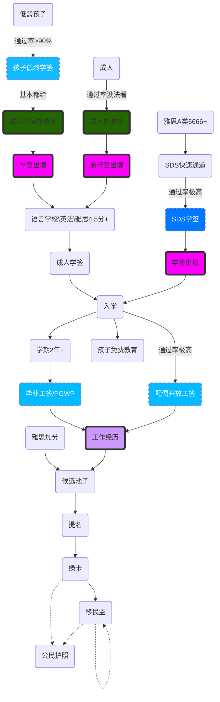

<!-- toc -->

# 修改日志
* 2022/10/28 初稿
# 归纳黄页
[移民归纳--鸽总日记](https://vball.fun/2022/10/28/imm-geziwang-roadmap/)

# TODO

- [ ] 移民路径

# 移民路径
这里针对普通人，能直接高学历高技术海外捞人的，忽略这段。  
文明国家中，你在目标国的工作决定你的移民。

# 旅行签的必要性