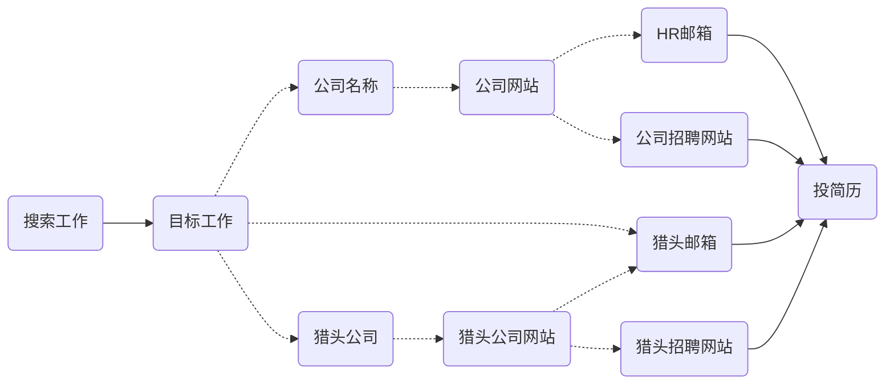

<!-- toc -->

# 修改日志
* 2022/10/28 初稿

# 归纳黄页
[移民归纳--鸽总日记](https://vball.fun/2022/10/28/imm-geziwang-roadmap/)

# 跑路新加坡的优缺点
这编文章的目的是简要介绍，给你各种可以搜索的关键词。 
## 优点

* 穷人屌丝也有机会润， 1万人民币你敢信
* 华语环境，不学英语也能过得滋润
* 发达国家，人文素养很高，工资也高
* 距离近，没有时差，以前据说1500往返飞中国
* 居住条件亚洲前列，不过最近房价上天了，组屋还是不错的
* 英联邦最佳跳板
* 淘宝无缝衔接
* 医疗社会福利，老人福利相对于其他英联邦较差
* 体育设施密度高，特别是游泳馆，很多小区都有

## 缺点

* 不准说缺点
* 地方小，世界尽头到世界尽头30公里
* 贵，相对大陆，什么都贵，不过有淘宝弥补
* 房租被润的华人抬上天了，只能住的偏僻
* 教育资源本地人优先

# 签证类型
精力有限，这里只是说穷人有关的签证了
1. EP
    - 工资有要求
    - 学历有要求
    - 无配额限制
    - 可以给家人申请DP，一家人整整齐齐
    - 半年后可以申请PR
2. SP
    - 大专以上
    - 一定时间后可以申请PR
3. WP
    - 建筑\制造\港口\服务业劳工，司机
    - 无学历要求
4. DP
    - 家属，孩子，一家人整整齐齐
    - 担保人薪水需达到6000新币以上
5. LTVP（长期探访准证-Long Term Visit Pass）
    - PR\公民的老人
    - PR配偶
    - 担保人工资有要求

签证类型和工资行业等挂钩，大家可以自己评估一下： 

[Employment / S Pass Self-Assessment Tool (SAT)](https://www.mom.gov.sg/eservices/services/employment-s-pass-self-assessment-tool)  
[新加坡签证类型及申请条件](https://zhuanlan.zhihu.com/p/440259784)  
[新加坡签证种类都有哪些](https://anjiasg.com/blog/types-of-work-visa-in-singapore/)

# 工资和成本

## 工资
这里都说的工作签证，有PR的大佬们请忽视。

| 类目 | 工资/新币 | 准证类型 |
| ---- | ---- | ---- |
| 码农 | 7000-12000+ | EP |
| 设计师 | 4000-7000+ | SP/EP |
| 教师 | 3000+ | SP/EP |
| 建筑\制造\港口劳工 | 2000-3000 | SP/WP |
| 美容按摩 | 2500-3500 | SP/WP |
| 厨房后厨 | 2000-3000 | WP |
| 司机 | 2500-4500 | WP |

## 生活成本

李家坡生活成本之高，不是吹的，不顾仁者见仁了
### 房租

| 类目 | 价格新币 | 面积平方米 | 备注 |
| ---- | ---- | ---- | ---- |
| 次卧 | 800-1200 | 12-20 | 1-2人 |
| 主卧 | 1000-1500 | 20-30 | 2-3人|
| 整套 | 2500-4000 | 70-100 | 最多可以给6个人办理地址证明 |
| 工地 | --- | ---  | ---  |

### 饮食
一个人一个月400-600吧，自己做饭的另说

# 找工作

### 找工作的精髓

1. 顺藤摸瓜
2. 找猎头

 
### mycareersfuture
新加披政府招聘网站，所以可能进行海外招聘的工作都大概率在上边公示。

[mycareersfuture](https://www.mycareersfuture.gov.sg/)
### indeed
indeed各国都适用(https://sg.indeed.com/)
### linkden
[领英嘛，记得翻墙使用 ](https://sg.linkedin.com/)

### 穷人穷玩法
#### 狮城论坛
我不清楚哪个是原装哪个是假货了。  

注意中介骗子挺多，不过不重要，信息的渠道很关键，完事开头难。
- [狮城论坛-sgcn.com](https://bbs.sgcn.com/forum-1255-1.html)
- [狮城论坛-shichengbbs..com](https://www.shichengbbs.com/c47)
- [狮城论坛-gongzuo.sg](https://www.gongzuo.sg/)

新加坡中介收費一般是5000RMB， 国内外中介会抬高到10000左右，太高就想想吧。  
#### 中介可以提供的服务
* 办理护照的证明资料
* 工作签证办理的全套手续

#### 穷人跑路职业类型

# 其他大佬的介绍网站
[润去新加坡 **https://run2.sg**](https://run2.sg)

# 发现有错误或者遗漏的可以留言，我会增补
