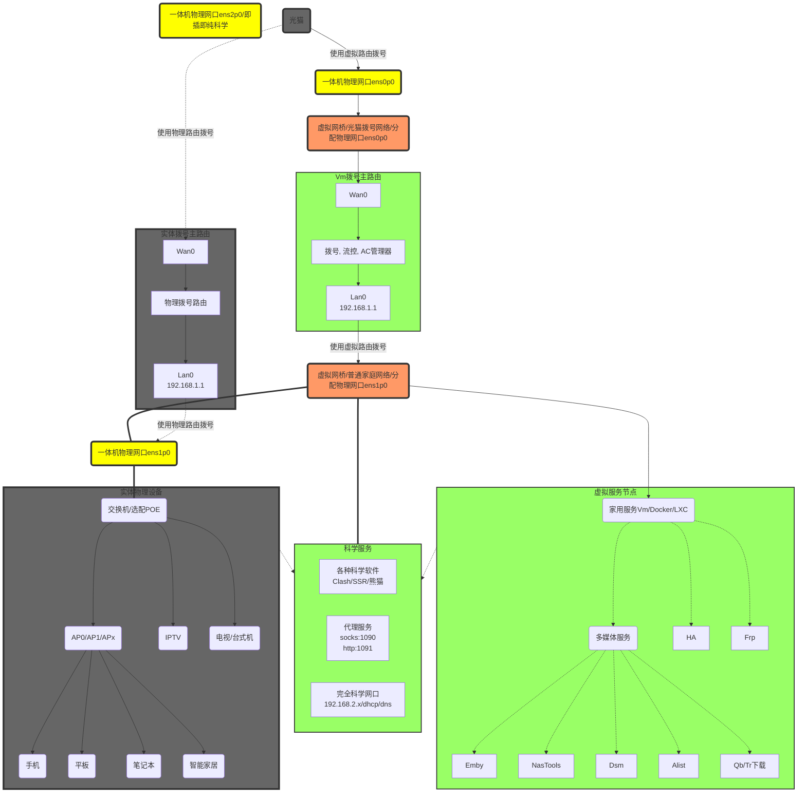
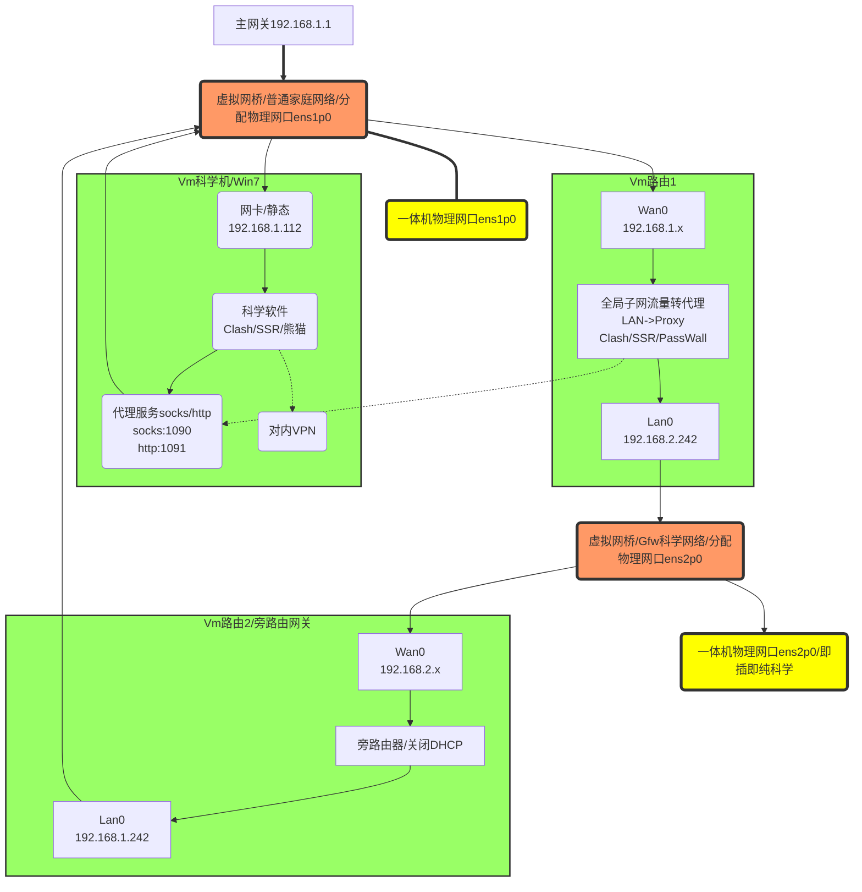
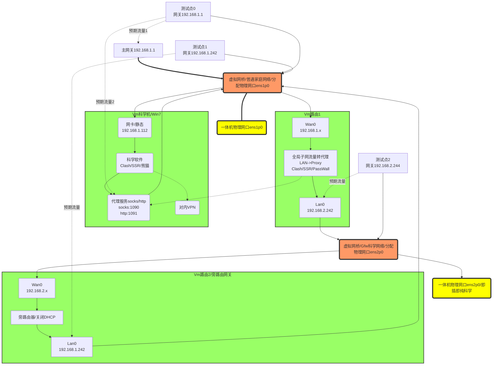

<!-- toc -->


# 需求说明

## 需求收集
- 所有设备都想访问Samba共享
- 部分设备需要完全科学网络
    - 机顶盒原生
    - 数据安全考量（仅供参考）
    - 强制数据流走向
- 部分应用只需要socks/http代理
    - SmartTubeNg支持第三方YouTube，仅需socks代理即可
    - chrome浏览器用Proxy SwitchyOmega上网
- 科学节点数量有限
    - 分享出去可以突破
    - 分享到广域网也可以。注意安全
##  科学方法及规划
这里不讨论分流问题，分流自己用浏览器插件控制   

- 插入特定物理网口完全科学
- 设置指定网关即可完全科学
- 指定socks代理可以自定义流量规则
- 默认网络不科学，不干扰日常流量

整理需要实现：
- 可以运行任何一款科学软件
- 在全局提供socks代理
- 提供一个完全科学的物理网口
- 提供手动完全可以的网关，并嵌入原始局域网网段


## 整体网络结构





## 科学部分


 
## 测试点预期流量

# PVE配置
这里仅仅是基于PVE测试，同样适用于unraid，Exsi等
# 网络配置

主机后边有两个网口，一个 标记为入（后续描述为网口1），一个标记为出（后续描述为网口2），请直接使用网线连接网口1到家庭的网络。

# 网络主机分配

这里有如下几种主机

|主机名字|IP地址|主机号|网桥|备注|
|:----|:----|:----|:----|:----|
|PVE服务器|192.168.1.240（网口1）<br>192.168.1.241（网口2）|    |br0<br>br1<br>br2|一般使用240就可以了，使用浏览器访问：[https://192.168.1.240:8006](https://192.168.1.240:8006)|
|代理机|192.168.1.242|110|br0|win7，可以安装熊猫或者clash，提供代理服务 ( socks5端口号1090， https代理1091)|
|网关机1|192.168.2.244|104|br1<br>br2|OP，任何接入网口出的设备，都能自动科学|
|网关机2|192.168.1.243|101|br0<br>br1|OP，所有数据流量走网口入，需要手动指定IP地址和网关地址192.168.1.243|
|测试机0|    |106|br0|测试网口入的家庭网络，不科学|
|测试机1|    |107|br0|测试网口入手动设置网关的科学网络|
|测试机2|    |105|br2|测试网口出的自动科学网络|
|nps穿透机|    |103|br0|用来远程接入网络，远程调试使用|
|win测试机|auto|109|切换后需要重启|调试网络，用来动态接入不同网络进行测试|


# 使用方法

通过网线连接网口入后，开机就可以使用任何一个浏览器访问PVE的web控制页面, 任何想要科学的主机，可以使用如下任意一种方法开启科学模式

## 模式一

客户机接入到与网口1同级网络，192.168.1.X，并且确保可以访问PVE的web页面，然后手动指定网关到网关机2（192.168.1.243），DNS设置为192.168.1.243或者8.8.8.8

## 模式二

该模式需要将客户机连接到网络2同级网络（端口不够，可以使用交换机对网络2进行扩展），上网模式设置自动获取

# 打开任意主机的控制台

这里理解为显示器


win控制台


linux控制台


# 诊断方法

这里提供了三个测试机，接入不同的网络进行测试

默认网络测试命令: 
```bash
curl http://ifconfig.io/all

```

代理网络测试命令: 
```bash
proxychain4 curl http://ifconfig.io/all

```

该命令会反馈出不同的结果，可以观察结果中的IP和国家信息来判断是否已经科学。


测试机网络归属

|测试机名字|网桥|网关|科学|    |
|:----|:----|:----|:----|:----|
|test-gateway-0|br0|192.168.1.1|否，仅测试网络|    |
|test-gateway-0+proxychain4|br0|192.168.1.1|科学，使用win7 socks代理上网|    |
|test-gateway-1|br0|192.168.1.242|是|    |
|test-gateway-2|br2|192.168.2.244|是|    |


# 快照功能

任何一台虚拟机，都可以使用快照功能记录当前虚拟机的设置信息。如果出现问题，可以随时使用快照回滚的功能进行恢复。

## 创建快照

选择主机-> Snapshots->Take Snapshot


## 回滚快照

选择主机-> Snapshots->选择回滚的版本-> Rollback

# 关于备份

主机用了蜗牛的机箱（手边没有其他的。。），所有只有两个最下边的硬盘槽位可以用来引导系统 ，在任意一个槽位插入硬盘，上电确保亮灯应该就可以启动系统。

随机有两个系统盘，内容完全一样，用来作为备份引导盘救急，所以平时只需要插入一个硬盘就可以，另一个硬盘拆下来收藏起来即可（插入槽位就会上电，会影响硬盘寿命）


# 重置密码

## 服务器密码重置

* Boot into **grub**, select ***single user*** but **do not press enter**.
* Press **e** to go into **edit** mode.
* Scroll down to the **kernel** line you will boot from, it starts with "linux /boot/vmlinuz-……."
* Scroll to the end of that line and press **space key** once and type init=/bin/bash
* Press **Ctrl X** to boot
```plain
# Remount / as Read/Write
mount -rw -o remount /
# Change the root account password with
passwd
# Change any other account password with
passwd username
# type new password, confirm and hit enter and then reboot.
```


