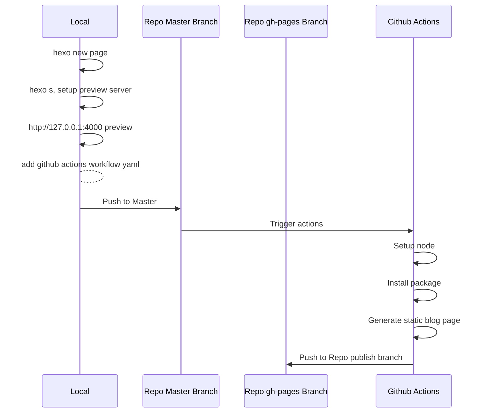

# Fxxk Travis Ci stopped generating my page
One day, After I updated some blog and there was no update on my Github page blog, then I checked the Travis-CI, it showed **Builds have been temporarily disabled for public repositories**

Then, whatever, F it. I spent more than 2 hours setting up my Credit Card to activate the Travis-CI service, and now It just down and without any notifications.
# Back to GitHub actions
Luckily, Github provides the workflows with actions.

## Github workflow yaml setting
Code talks firstly
```yaml
# This workflow will do a clean install of
# node dependencies, cache/restore them,
# build the source code and run tests across different versions of node
# For more information see:
# https://help.github.com/actions/language-and-framework-guides/using-nodejs-with-github-actions

---
name: Node.js CI

on:
  push:
    branches:
      - master

jobs:
  build:
    runs-on: ubuntu-latest
    steps:
      - name: Checkout
        uses: actions/checkout@v2
      - name: Setup Node
        uses: actions/setup-node@v2
        with:
          node-version: '14'
      - name: Setup Env
        run: |
          npm install -g hexo-cli@4.0.0
          npm install
          hexo generate
      - name: Deploy
        uses: peaceiris/actions-gh-pages@v3
        with:
          deploy_key: ${{ secrets.HEXO_DEPLOY_PRI }}
          publish_dir: ./public
          publish_branch: gh_pages  # deploying branch

```
# Workflow detail
## Setup basic Node based on ubuntu
```yaml
on:
  push:
    branches:
      - master

jobs:
  build:
    runs-on: ubuntu-latest
    steps:
      - name: Checkout
        uses: actions/checkout@v2
      - name: Setup Node
        uses: actions/setup-node@v2
        with:
          node-version: '14'
```
## Install hexo to CI system and build
```yaml
      - name: Setup Env
        run: |
          npm install -g hexo-cli@4.0.0
```
if we do not install this version globally, then the CI will not find the hexo command.
## Install other packages and generate the static page
```yaml
          npm install
          hexo generate
```
## Deploy to Repo gh-pages branch with deploy tools
```yaml
      - name: Deploy
        uses: peaceiris/actions-gh-pages@v3
        with:
          deploy_key: ${{ secrets.HEXO_DEPLOY_PRI }}
          publish_dir: ./public
          publish_branch: gh_pages  # deploying branch
```
It will deploy your Ci public directory to your repo gh_pages branch.
## Actions Related Resource
If you need more help, just [peaceiris/actions-gh-pages@v3](https://github.com/marketplace/actions/github-pages-action) pages for more help.
### This actions support many tokens


If you just need https, choose github_token, and if you prefer to ssh, you can use deploy_key(it's my style)


## Last, DO NOT forget to update your page setting to your gh-pages branch


