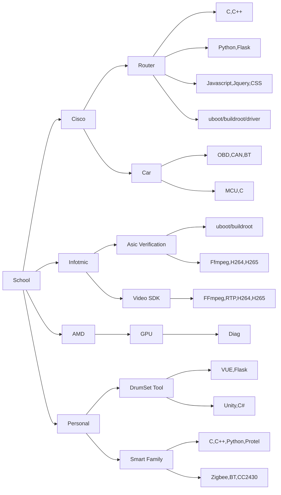

个人详细介绍
知识体系
```json
{
  name: "Ball Virtual"
  gender: "male",
  title: "Senior Firmware Engineer",
  experience: 10.5,
  address: "Shanghai",
  education: "Bachelor",
  github: "https://github.com/godvmxi",
  email: "godvmxi@gmail.com",
  description: "Better life, more challenging, more fun",

  skills: [
    ["VCodec", "C++", "Python", "H264", "HEVC", "VP9","FFmpeg","RTP"],
    ["Linux", "Kernel" "C", "Bash","Buildroot","Uboot", "Buildroot"],
    ["Asic", "RTL", "Verlog","ARM"],
    ["Router","Network", "CCNA", "Flask","ARM", "VUE"],
    ["Git","Gerrit","Github"],
    ["PCB","MCU","BT","OBD","CAN","GPRS","Rs232","SPI"],
    ["Unity","C#"]
  ],

  devTools: [
    ["VIM","Vscode","GCC","GDB"],
    ["Elecard", "FFmpeg"],
    ["Source Insight"],
    ["Unity"],
    ["Protel","Logic Analyzer","Oscilloscope"]
  ]
}

```


